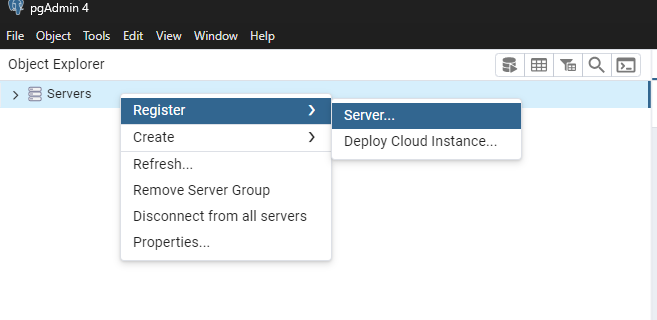
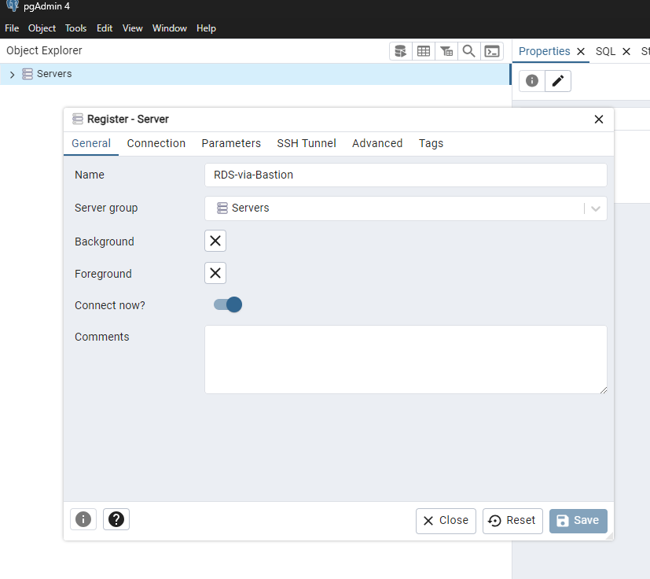
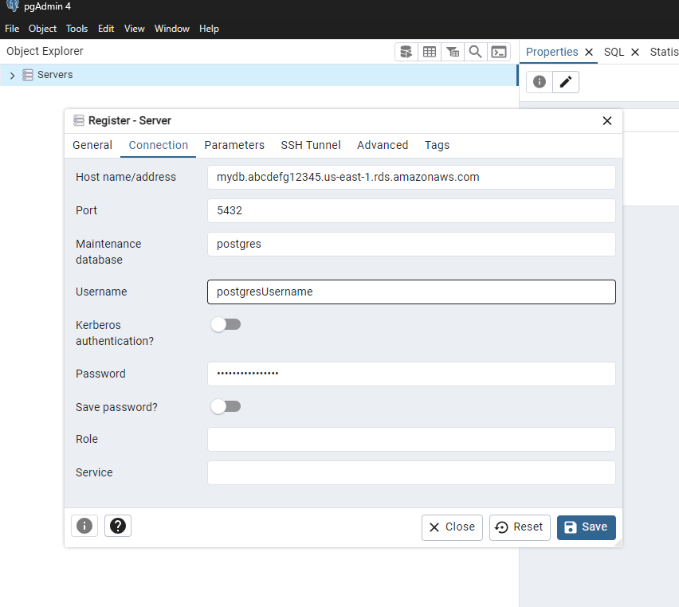
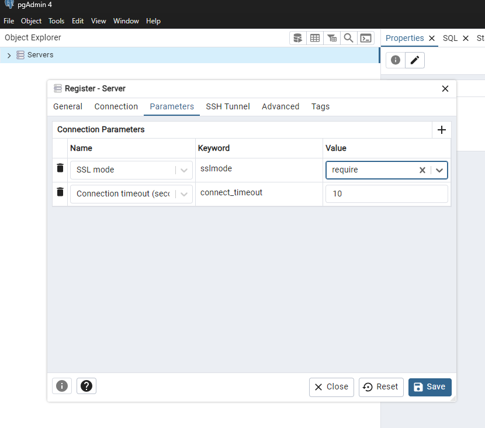
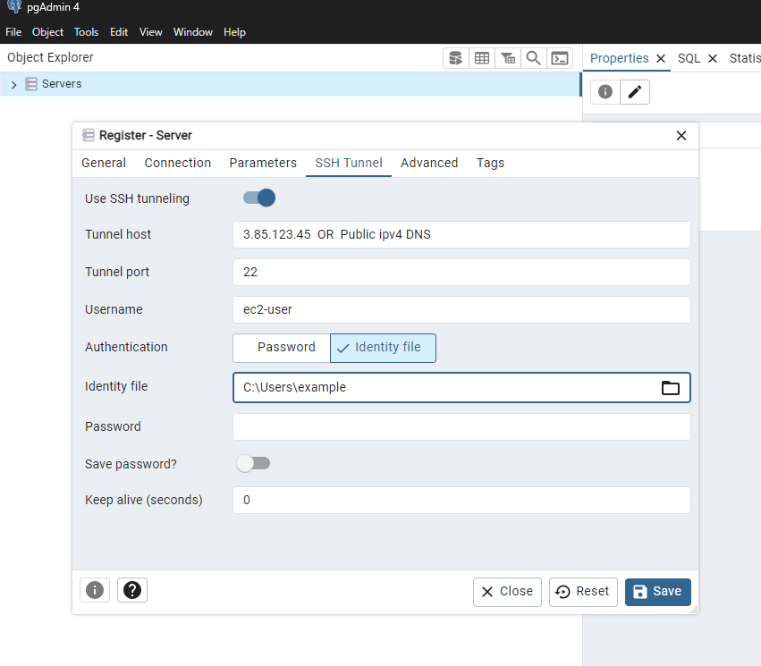
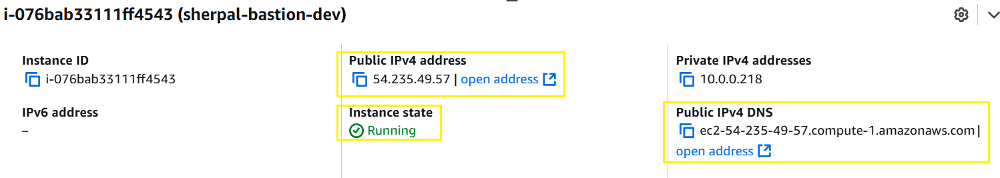

# pgAdmin SSH Tunneling Setup for AWS RDS PostgreSQL via Bastion Host

## Prerequisites
1. **AWS RDS PostgreSQL** instance (running and accessible from the Bastion).
2. **Bastion Host** (EC2 instance) (running and accessible from your local machine).
3. **pgAdmin** installed on your local system.
4. **Private key** (.pem file) for SSH access to the Bastion.
5. **Security groups** configured to allow necessary traffic.

---

## Step 1: Configure SSH Tunnel in pgAdmin

### 1.1 Create a New Server in pgAdmin
1. Open **pgAdmin**.
2. Right-click on **Servers** → **Create** → **Server**.
3. **General Tab:**
   - **Name:** `RDS-via-Bastion` (or any name for your server).
 

 

---

### 1.2 Connection Tab
1. **Host name/address:**
   - Enter your RDS Endpoint (`mydb.abcdefg12345.us-east-1.rds.amazonaws.com`).
2. **Port:** `5432`.
3. **Maintenance Database:** `postgres` (or your actual database name).
4. **Username:** Enter your **PostgreSQL username**.
5. **Password:** Enter your **PostgreSQL password**.

 

---

### 1.3 Parameters Tab
1. **SSL Mode:** `Require` (for security).

   
  

---

### 1.4 SSH Tunnel Tab
1. **Use SSH Tunneling:**  Enable it.
2. **Tunnel host:**
   - Enter your **Bastion Host’s Public IP** (`3.85.123.45`).
3. **Tunnel port:** `22` (default SSH port).
4. **Username:**
   - Enter your **EC2 username** (`ec2-user` for Amazon Linux).
5. **Authentication method:** `Identity file`.
6. **Identity file:**
   - Click **Browse** and select your **private key** (`.pem` file).
  
  

  

---

## Step 2: Save & Connect
1. Click **Save**.
2. Right-click on the server → Click **Connect**.
3. If the connection is successful, you should see your **RDS database** in **pgAdmin**.
